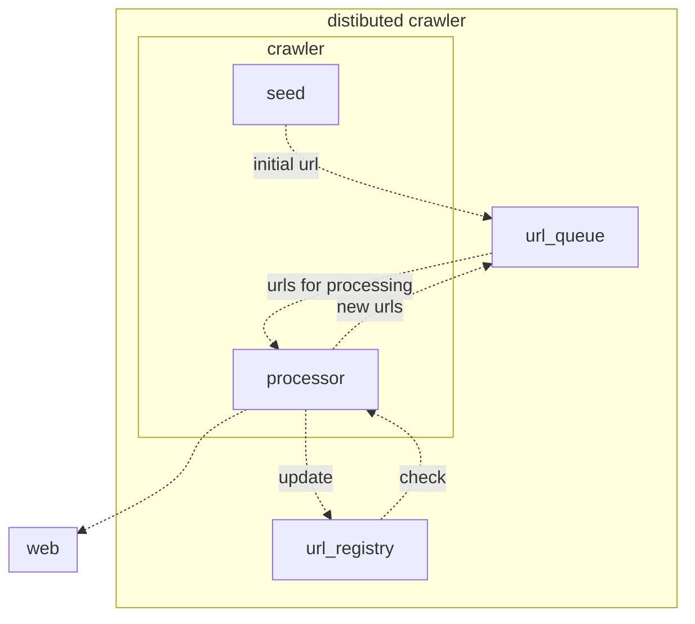

crawler keeps visited pages data in `url_registry`

- to avoid duplication
- for report.

data scheme:

- url
- depth
- scan_id
- timestamp
- hostname
- rank

key is `(scan_id,url)`

`url_queue` message schema:

- url
- depth
- scan_id

url_registry is a redis (was chosen because of its simplicity, and distribution capabilities)

url_queue is a rabbitmq (was chosen because of its simplicity, and routing and flexible exchange types support)

# CLI

#### start crawler command

```
$ python3 web_crawler.py start-crawler --help
  --root TEXT      url to crawl  [required]
  --depth INTEGER  recursion depth limit, --depth 1 meaning only root page
                   will be scanned    [required]
  --help           Show this message and exit.
```

#### example

```
$ python3 web_crawler.py start-crawler --root https://medium.com/ --depth 3
```

#### save report command

```
$ python3 web_crawler.py  save-report --help
  --scan-id TEXT  scan id  [required]
  --output TEXT   path to output file  [required]
  --help          Show this message and exit.
```

#### example

```
python3 web_crawler.py save-report --output=result.tsv --scan-id=bca240552e404b6ab0eeee3ea76b6a0b
```
